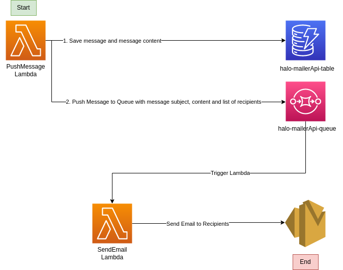

# Halo Send Email API

This API is intend for internal use only.

## The Architecture


## API

**Method**: POST
**URL**: https://655ef1mgz7.execute-api.eu-west-1.amazonaws.com/dev/message/push
**ReqBody**:
```json
{
    "messageContent": "Hey Aman, You would get email to iam.amanattrish@gmail.com",
    "recipients": [
        "amanattrish1@halomailer.com"
    ],
    "messageSubject": "Halo Email Subject"
}
```

**ResBody**:
```json
{
    "message": "Success, Messages save in db and pushed to SQS",
    "data": {
        "ResponseMetadata": {
            "RequestId": "1e291b30-0f92-5820-912c-40c9a963a09d"
        },
        "MD5OfMessageBody": "ea514fe31a4066a8f4fc5312491e9200",
        "MD5OfMessageAttributes": "8b210a0aa207b5da889f2588c5871908",
        "MessageId": "c6e8aee7-045e-4225-9361-b40f20a3f070"
    }
}
```

**Note**: The Lambda only has permission to send email to email ids on halomailer.com domain. 